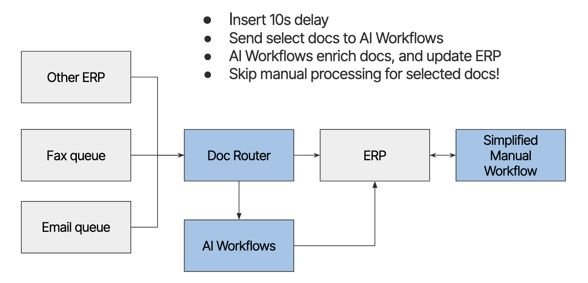

## Smart Document Router
* The [DocRouter.AI](https://docrouter.ai) is an open source Document Understanding Tool. 
* It performs data extraction, at scale, for intelligent automation in a number of verticals: Supply Chain, Healthcare, Finance.

---

<section>
    <h2>Live Demo</h2>
    <div style="text-align: center; padding: 40px;">
        <a href="https://app.docrouter.ai" 
           target="_blank" 
           style="padding: 20px 40px; 
                  background: #4A9EFF; 
                  color: white; 
                  text-decoration: none; 
                  border-radius: 5px;">
            Launch DocRouter.AI Demo ↗️
        </a>
    </div>
</section>

---

## Use Cases

<div style="text-align: left">

<span style="color: #4A9EFF">**Clinical Trial Invoice Processing**</span>
* **Document Type**: Lab service invoices

<span style="color: #FF6B6B">**Supply Chain**</span>
* **Document Type**: Shipping container manifests

<span style="color: #4ECB71">**Private Equity**</span> 
* **Document Type**: Company annual reports

</div>

---

## Inline Setup



---
## Software Stack

* [DocRouter.AI](https://docrouter.ai) is implemented using:
  * [NextJS](#/4), NextAuth, TailwindCSS
  * FastAPI, Pydantic
  * AWS, MongoDB
  * LiteLLM
---

## What is NextJS? 🤔

* A powerful framework built on top of React
* Created by Vercel
* Used by companies like Netflix, Twitch, and Uber

---

# NextJS Folder Structure
## DocRouter's Frontend Organization

---

# Frontend Folder Structure 📁

```
frontend/
├── src/ # Main source code
├── public/ # Static files
├── node_modules/ # Dependencies
├── next.config.mjs # NextJS configuration
├── package.json # Project metadata
```

---

```
src/
├── app/ # New App Router pages
│ ├── layout.tsx # Root layout
│ ├── page.tsx # Home page
│ ├── auth/ # Authentication pages
│ └── orgs/ # Organization pages
│
├── components/ # Reusable React components
│ ├── Layout.tsx # Main layout wrapper
│ ├── PDFViewer.tsx # PDF viewing component
│ └── ...
│
├── utils/ # Helper functions
│ ├── api.ts # API client
│ └── session.ts # Auth utilities
├── contexts/ # React contexts
│ └── OrganizationContext.tsx
│
├── styles/ # CSS and styling
└── types/ # TypeScript type definitions
```

---
* Components
* Layout
* Pages
---

(Include pic of prompts component here)

---

```js
// prompts.tsx

import React, { useState, useEffect, useCallback } from 'react';
// ...More imports here

const Prompts: React.FC<{ organizationId: string }> = ({ organizationId }) => {
  const [prompts, setPrompts] = useState<Prompt[]>([]);
  const [currentPromptId, setCurrentPromptId] = useState<string | null>(null);
  const [currentPrompt, setCurrentPrompt] = useState<PromptConfig>({
    name: '',
    content: '',
    schema_name: undefined,
    schema_version: undefined,
    tag_ids: [],
    model: undefined
  });
  
  // ... More JS code here
  
  return (
    <div className="p-4 max-w-4xl mx-auto">
      {/* Prompt Component */}
      <div className="bg-white p-6 rounded-lg shadow mb-6">
        <h2 className="text-xl font-bold mb-4">
          {currentPromptId ? 'Edit Prompt' : 'Create Prompt'}
        </h2>
      {/* ... */}
      </div>
    </div>
  );
};

export default Prompts;
```

---

## What is unique about NextJS? 🤔

* Server Components 🚀
  * **Unique to NextJS**: First major framework to implement React Server Components
---
## Slide 3